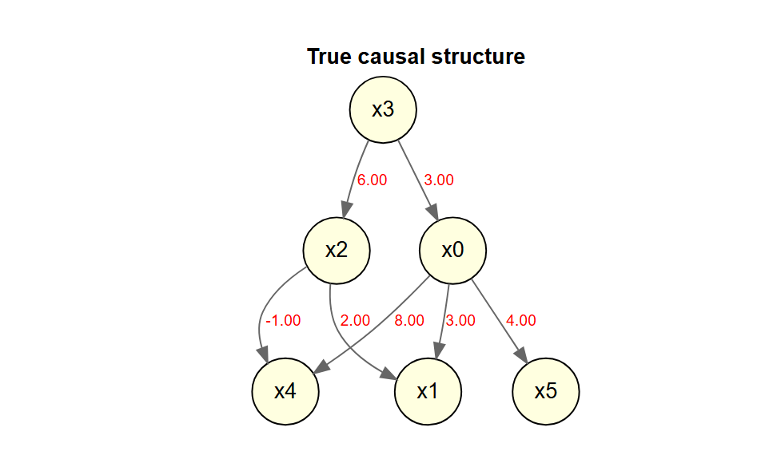
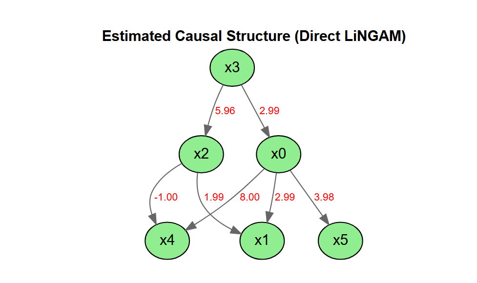
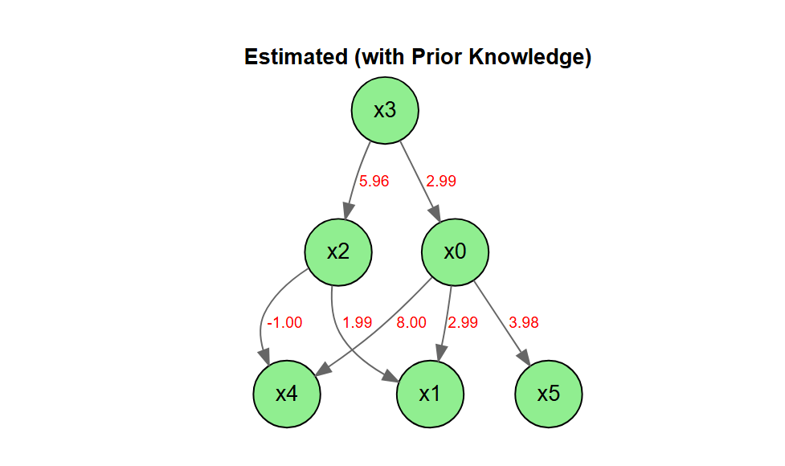
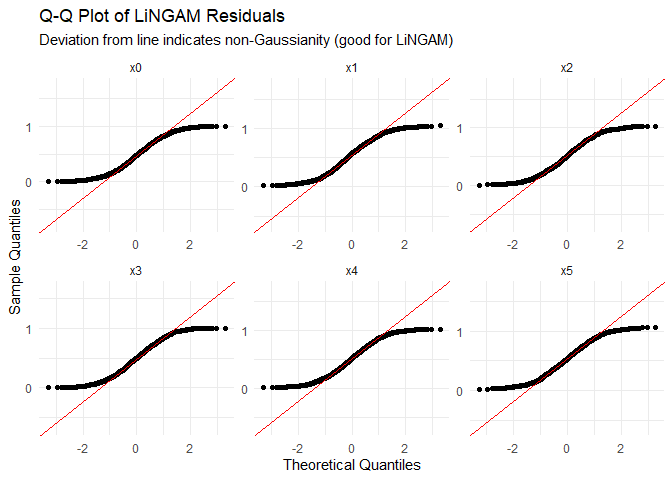
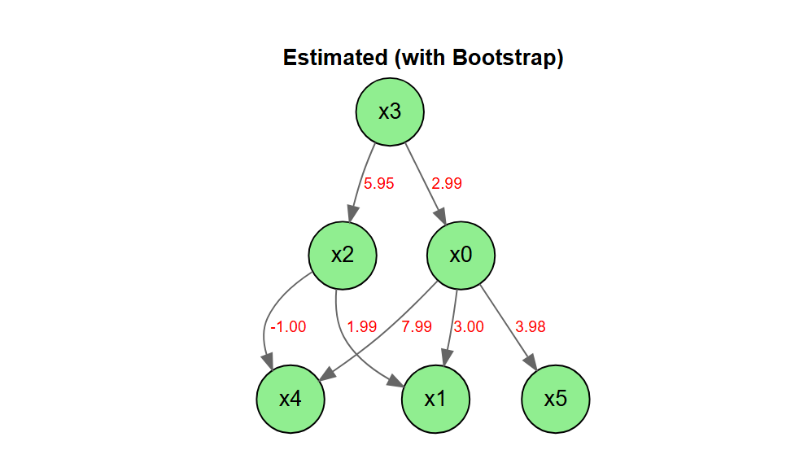
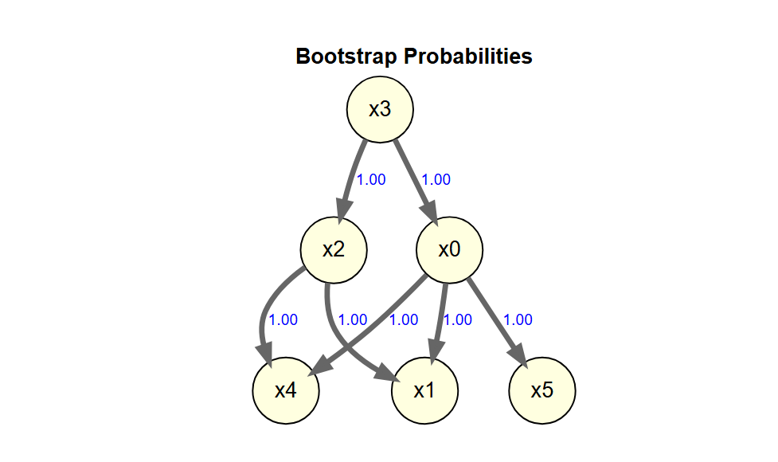

<!-- README.md is generated from README.Rmd. Please edit that file -->

# DirectLiNGAM

<!-- badges: start -->

[](https://lifecycle.r-lib.org/articles/stages.html)
<!-- badges: end -->

LiNGAM is a new method for estimating structural equation models or
linear Bayesian networks. It is based on using the non-Gaussianity of
the data.

This package is a port of the Python lingam package to R.

- [The LiNGAM Project](https://sites.google.com/view/sshimizu06/lingam)
- [lingam](https://github.com/cdt15/lingam)

`DirectLiNGAM` is a port to R of the
[LiNGAM](https://github.com/cdt15/lingam) package (LiNGAM: Linear
Non-Gaussian Acyclic Model), which is available in Python.

This is currently an alpha version under development, and we are
releasing it for the purpose of testing and gathering feedback.

## Features

- Implementation of the Direct LiNGAM algorithm
- Stability assessment of causal structures using the bootstrap method
- Visualization of estimation results using DiagrammeR

## Important Notes

- This package does not include all the features of the Python version.
- This package also includes features that are not present in the Python
  version.

## Installation

You can install the development version of DirectLiNGAM from
[GitHub](https://github.com/) with:

``` r
# install.packages("pak")
pak::pak("morimotoosamu/DirectLiNGAM")
```

## Requirements

- DiagrammeR
- glmnet

## Usage

### Sample Data

``` r
library(DirectLiNGAM)
data(LiNGAM_sample_1000)

m <- matrix(
  c(0.0, 0.0, 0.0, 3.0, 0.0, 0.0,
    3.0, 0.0, 2.0, 0.0, 0.0, 0.0,
    0.0, 0.0, 0.0, 6.0, 0.0, 0.0,
    0.0, 0.0, 0.0, 0.0, 0.0, 0.0,
    8.0, 0.0,-1.0, 0.0, 0.0, 0.0,
    4.0, 0.0, 0.0, 0.0, 0.0, 0.0),
  nrow = 6, byrow = TRUE
  )

colnames(m) <- rownames(m) <- colnames(LiNGAM_sample_1000)

m |>
  plot_adjacency_diagrammer(
  labels      = colnames(LiNGAM_sample_1000),
  title = "True causal structure",
  rankdir     = "TB",
  shape       = "circle"
)
```



### Causal Discovery

独立性の評価はデフォルトでは相互情報量(mutual infomation)を用います。

HSIC(Hilbert-Schmidt Independence Criterion)を使いたい場合は引数で
`measure = "kernel"` を指定します。ただし、実行速度が非常に遅いです。

係数の算出はデフォルトでは Adaptive LASSO を用います。

``` r
model <- direct_lingam(LiNGAM_sample_1000, lambda = "BIC")
```

### Causal Order

推定された因果の順序を確認します。

``` r
# index number
model$causal_order
#> [1] 4 1 3 2 5 6

# variable name
colnames(LiNGAM_sample_1000)[model$causal_order]
#> [1] "x3" "x0" "x2" "x1" "x4" "x5"
```

### Estimated Adjacency Matrix

推定された効果の量を確認します。

``` r
B_hat <- model$adjacency_matrix
colnames(B_hat) <- rownames(B_hat) <- colnames(LiNGAM_sample_1000)
round(B_hat, 3)
#>       x0 x1     x2    x3 x4 x5
#> x0 0.000  0  0.000 2.994  0  0
#> x1 2.995  0  1.993 0.000  0  0
#> x2 0.000  0  0.000 5.956  0  0
#> x3 0.000  0  0.000 0.000  0  0
#> x4 7.997  0 -1.004 0.000  0  0
#> x5 3.979  0  0.000 0.000  0  0
```

### Plot The Estimated Causal Graph

推定された隣接行列に基づいて、因果グラフを描きます。

``` r
B_hat |>
  plot_adjacency_diagrammer(
      labels = colnames(LiNGAM_sample_1000),
      title = "Estimated Causal Structure (Direct LiNGAM)",
      rankdir = "TB",
      shape = "ellipse",
      fillcolor = "lightgreen"
      )
```



### Calculating The Total Causal Effect

推定されたすべての総合効果を算出します。

``` r
LiNGAM_sample_1000 |>
  estimate_all_total_effects(model) |>
  round(3)
#>       x0 x1     x2     x3    x4 x5
#> x0 0.000  0  0.000  2.994 0.000  0
#> x1 3.116  0  2.183 20.836 0.000  0
#> x2 0.058  0  0.000  5.957 0.000  0
#> x3 0.000  0  0.000  0.000 0.000  0
#> x4 7.908  0 -0.443 17.957 0.000  0
#> x5 3.977  0  0.241 11.898 0.021  0
```

### Inference Based On Prior Knowledge

事前知識を用いた実行例です。

#### Specify In The Index

- 変数の数は6個
- x3 is an exogenous variable.
- x1, x4, and x5 are sink_variables.
- x0 to x2 are no path.

``` r
pk1 <- make_prior_knowledge(
  n_variables         = 6,
  exogenous_variables = 4,
  sink_variables = c(2, 5, 6),
  no_paths = list(c(3, 1), c(1, 3))
)

pk1
#>      [,1] [,2] [,3] [,4] [,5] [,6]
#> [1,]   -1    0    0   -1    0    0
#> [2,]   -1   -1   -1   -1    0    0
#> [3,]    0    0   -1   -1    0    0
#> [4,]    0    0    0   -1    0    0
#> [5,]   -1    0   -1   -1   -1    0
#> [6,]   -1    0   -1   -1    0   -1
```

Direct LiNGAM を実行する際に、引数 `prior_knowledge`
に事前知識を指定します。

``` r
model_pk1 <- LiNGAM_sample_1000 |>
  direct_lingam(prior_knowledge = pk1, lambda = "BIC")

cat("Causal Order: ", colnames(LiNGAM_sample_1000)[model_pk1$causal_order], "\n")
#> Causal Order:  x3 x0 x2 x1 x4 x5
```

結果の隣接行列に基づいて因果グラフを描きます。

``` r
B_pk <- model_pk1$adjacency_matrix
colnames(B_pk) <- rownames(B_pk) <- colnames(LiNGAM_sample_1000)
round(B_pk, 3)
#>       x0 x1     x2    x3 x4 x5
#> x0 0.000  0  0.000 2.994  0  0
#> x1 2.995  0  1.993 0.000  0  0
#> x2 0.000  0  0.000 5.957  0  0
#> x3 0.000  0  0.000 0.000  0  0
#> x4 7.998  0 -1.005 0.000  0  0
#> x5 3.980  0  0.000 0.000  0  0

plot_adjacency_diagrammer(
  B_pk,
  labels      = colnames(LiNGAM_sample_1000),
  title = "Estimated (with Prior Knowledge)",
  rankdir     = "TB",
  shape       = "circle",
  fillcolor   = "lightgreen"
)
```



### Independence between error variables

LiNGAMでは残差が独立であることがを仮定している。

get_error_independence_p_values関数は残差間の独立性の検定のp値を返す。

Calculation of the p-value (default: Spearman)

``` r
result <- LiNGAM_sample_1000 |>
  direct_lingam()

p_vals <- LiNGAM_sample_1000 |>
  get_error_independence_p_values(result)
round(p_vals, 3)
#>       x0    x1    x2    x3    x4    x5
#> x0    NA 0.998 0.056 0.976 0.855 0.123
#> x1 0.998    NA 0.923 0.999 0.302 0.090
#> x2 0.056 0.923    NA 0.976 0.857 0.895
#> x3 0.976 0.999 0.976    NA 0.942 0.585
#> x4 0.855 0.302 0.857 0.942    NA 0.524
#> x5 0.123 0.090 0.895 0.585 0.524    NA
```

### 正規性の検定

残差の正規性の検定を行う

``` r
# サンプルデータの呼び出し
data(LiNGAM_sample_1000)

# Direct LiNGAM の実行
result <- direct_lingam(LiNGAM_sample_1000)
 
# Shapiro-Wilk (default)
test_residual_normality(LiNGAM_sample_1000, result)
#> === Residual Normality Test ===
#> Method:         shapiro
#> Sample size:    1000
#> Significance:   0.050
#> Non-Gaussian:   6 / 6 variables
#> 
#>  variable statistic   p_value is_non_gauss skewness kurtosis
#>        x0    0.9514 < 2.2e-16         TRUE    0.079   -1.221
#>        x1    0.9549 < 2.2e-16         TRUE   -0.100   -1.176
#>        x2    0.9566  1.22e-16         TRUE    0.016   -1.185
#>        x3    0.9571  1.61e-16         TRUE    0.033   -1.165
#>        x4    0.9555 < 2.2e-16         TRUE    0.025   -1.191
#>        x5    0.9610  1.09e-15         TRUE    0.010   -1.126
#> 
#> Interpretation:
#>   is_non_gauss = TRUE  -> rejects normality (supports LiNGAM assumption)
#>   is_non_gauss = FALSE -> cannot reject normality (LiNGAM may not fit)
#> 
#> All residuals are non-Gaussian. LiNGAM assumption is supported.
```

QQプロットでも残差の正規性を確認する

``` r
# サンプルデータの呼び出し
data(LiNGAM_sample_1000)

# Direct LiNGAM の実行
result <- direct_lingam(LiNGAM_sample_1000)

plot_residual_qq(LiNGAM_sample_1000, result)
```



### Bootstrap Direct LiNGAM

``` r
bs_model <- LiNGAM_sample_1000 |>
  bootstrap_lingam(n_sampling = 30L, seed = 42)
#> Bootstrap: 30 iterations, method=adaptive_lasso
#>   iteration 1 / 30
#>   iteration 10 / 30
#>   iteration 20 / 30
#>   iteration 30 / 30
#> Completed in 5.9 seconds.

bs_model
#> BootstrapResult: 30 samplings, 6 features
```

係数

``` r
bs_model |>
  get_causal_direction_counts(labels = names(LiNGAM_sample_1000))
#>   from to count proportion mean_effect median_effect   sd_effect  ci_lower
#> 1    1  2    30          1    2.999478      3.000034 0.024778370  2.960955
#> 2    1  5    30          1    7.995598      7.993571 0.025933833  7.949036
#> 3    1  6    30          1    3.980438      3.981888 0.009968875  3.963580
#> 4    3  2    30          1    1.990247      1.990514 0.012479154  1.967352
#> 5    3  5    30          1   -1.003159     -1.003891 0.014890399 -1.026718
#> 6    4  1    30          1    2.990307      2.993976 0.028665229  2.927646
#> 7    4  3    30          1    5.951686      5.950718 0.026991172  5.909625
#>     ci_upper from_name to_name
#> 1  3.0438051        x0      x1
#> 2  8.0476302        x0      x4
#> 3  4.0013215        x0      x5
#> 4  2.0087882        x2      x1
#> 5 -0.9736465        x2      x4
#> 6  3.0328700        x3      x0
#> 7  6.0130651        x3      x2
```

平均因果効果の隣接行列

``` r
bs_adjacency_matrix <- bs_model |>
  get_adjacency_matrix_summary(stat = "median")

bs_adjacency_matrix |>
  round(3)
#>       [,1] [,2]   [,3]  [,4] [,5] [,6]
#> [1,] 0.000    0  0.000 2.994    0    0
#> [2,] 3.000    0  1.991 0.000    0    0
#> [3,] 0.000    0  0.000 5.951    0    0
#> [4,] 0.000    0  0.000 0.000    0    0
#> [5,] 7.994    0 -1.004 0.000    0    0
#> [6,] 3.982    0  0.000 0.000    0    0
```

係数の可視化（係数0.5以上のパスを描画）

``` r
bs_adjacency_matrix |>
  plot_adjacency_diagrammer(
    threshold = 0.5,
    labels      = colnames(LiNGAM_sample_1000),
    title = "Estimated (with Bootstrap)",
    rankdir     = "TB",
    shape       = "circle",
    fillcolor   = "lightgreen"
    )
```



ブートストラップ確率の行列

``` r
bs_model |>
  get_probabilities() 
#>      [,1] [,2] [,3] [,4] [,5] [,6]
#> [1,]    0    0    0    1    0    0
#> [2,]    1    0    1    0    0    0
#> [3,]    0    0    0    1    0    0
#> [4,]    0    0    0    0    0    0
#> [5,]    1    0    1    0    0    0
#> [6,]    1    0    0    0    0    0
```

平均総合効果

``` r
bs_model |>
  get_total_causal_effects()
#>    from to     effect probability
#> 1     1  2  3.1249145   1.0000000
#> 2     1  5  7.9077103   1.0000000
#> 3     1  6  3.9822275   1.0000000
#> 4     3  2  2.2281291   1.0000000
#> 5     4  1  2.9939760   1.0000000
#> 6     4  2 20.8047080   1.0000000
#> 7     4  3  5.9517481   1.0000000
#> 8     4  5 17.9702666   1.0000000
#> 9     4  6 11.8995582   1.0000000
#> 10    3  5 -0.4602349   0.8333333
#> 11    3  6  0.2631429   0.3000000
#> 12    6  2 -0.2299079   0.1666667
```

bootstrapの結果を因果グラフに

デフォルトでは50%以上出現しているパスを表示

``` r
bs_model |>
  plot_bootstrap_probabilities()
```



### sample data 10000

``` r
data(LiNGAM_sample_10000)

m <- matrix(c(
  0, 0, 0, 3, 0, 0, 0, 0, 0, 0,
  3, 0, 2, 0, 0, 0, 0, 0, 0, 0,
  0, 0, 0, 6, 0, 0, 0, 0, 0, 0,
  0, 0, 0, 0, 0, 0, 0, 0, 0, 0,
  8, 0, -1, 0, 0, 0, 0, 0, 0, 0,
  4, 0, 0, 0, 0, 0, 0, 0, 0, 0,
  0, 2, 0, 0, 0, 0, 0, 0, 0, 0,
  3, 0, 0, 0, 1.5, 0, 0, 0, 0, 0,
  0, 0, 0.5, 0, 0, 2, 0, 0, 0, 0,
  0, 0, 0, 7, 0, 0, 1, 0, 0, 0
  ),
  nrow = 10, byrow = TRUE
  )

colnames(m) <- rownames(m) <- colnames(LiNGAM_sample_10000)

m |>
  plot_adjacency_diagrammer(
  labels      = colnames(LiNGAM_sample_10000),
  title = "True causal structure",
  rankdir     = "TB",
  shape       = "circle"
)
```


## Licence

MIT License

Original work: Copyright (c) 2019 T.Ikeuchi, G.Haraoka, M.Ide,
W.Kurebayashi, S.Shimizu

Portions of this work: Copyright (c) 2026 O.Morimoto

## References

### Algorithm

- Shimizu, S. et al. (2011). DirectLiNGAM: A direct method for learning
  a linear non-Gaussian structural equation model. *Journal of Machine
  Learning Research*, 12, 1225-1248. \### Original Implementation
  (Python)
- Ikeuchi, T. et al. (2023). Python package for LiNGAM algorithms.
  *Journal of Machine Learning Research*, 24(14), 1-7.  
  <https://github.com/cdt15/lingam> \### Books
- 清水昌平(2017)『統計的因果探索』講談社.
- 梅津佑太・西村龍映・上田勇祐(2020)『スパース回帰分析とパターン認識』講談社.
- 鈴木譲(2025)『グラフィカルモデルと因果探索100問 with R』共立出版. \###
  R Packages Referenced
- G. Kikuchi (2020). rlingam <https://github.com/gkikuchi/rlingam>

## Feedback

Please submit bug reports and feature requests via GitHub Issues.
